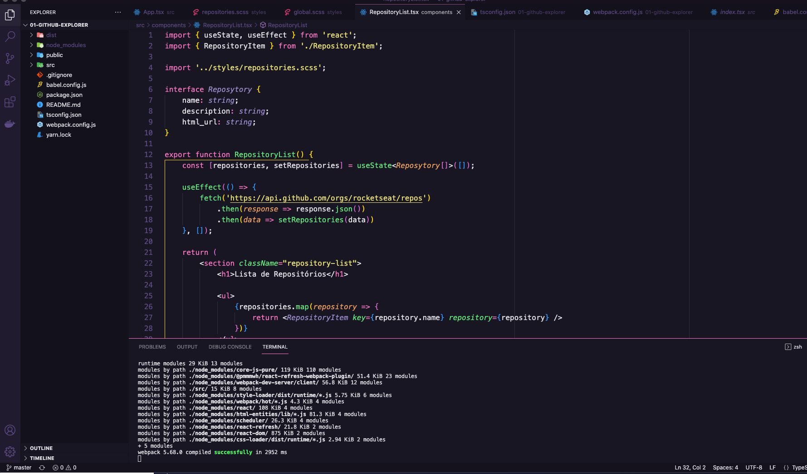

# 🚀 Chapter I - Ignite
No primeiro módulo da trilha de ReactJS do Ignite da Rocketseat, foi criado a estrutura base de uma aplicação ReactJS utilizando ferramentas como Webpack, Babel, Webpack Dev server, SASS, Source Maps, Fast Refresh e conceitos importantes do React como componentes, propriedades, estados, hooks e TypeScript para adicionar tipagem estática à aplicação.

    

